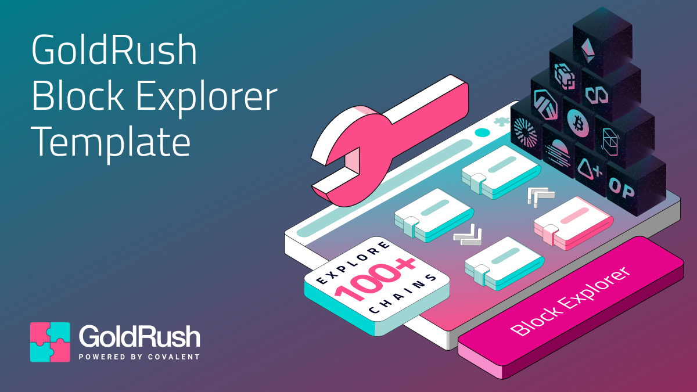
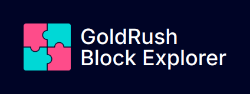

<div align="center">
  <a href="https://goldrush.dev/products/goldrush/"  target="_blank" rel="noopener noreferrer">
    
  </a>
  <br />

[](https://github.com/covalenthq/goldrush-block-explorer-ui/blob/main/LICENSE)
[](https://github.com/covalenthq/goldrush-block-explorer-ui/commits/master)
[](https://github.com/covalenthq/goldrush-block-explorer-ui/graphs/contributors)
[](https://github.com/covalenthq/goldrush-block-explorer-ui/issues)
[](https://github.com/covalenthq/goldrush-block-explorer-ui/pulls)
[](https://github.com/covalenthq/goldrush-block-explorer-ui/stargazers)
[](https://github.com/covalenthq/goldrush-block-explorer-ui/network/members)

</div>

<br/>

<h1 align="center">Beautifully designed Block Explorer template.</h1>

<div align="center">
Powered by <span><a href="https://github.com/covalenthq/goldrush-kit">GoldRush UI Kit.</a></span> Open-source & Customizable. Supports 100+ Chains.
</div>

## View Live Template

<a href="https://goldrush-block-explorer-ui.vercel.app/">https://goldrush-block-explorer-ui.vercel.app</a>

Explore a live deployment of the template, showcasing its features and UI components in action. 

## One-Click Deploy

[](https://vercel.com/new/clone?repository-url=https%3A%2F%2Fgithub.com%2Fcovalenthq%2Fgoldrush-block-explorer-ui&env=NEXT_PUBLIC_GOLDRUSH_API_KEY&envDescription=Visit%20Covalent%20to%20sign%20up%20for%20an%20API%20key&envLink=https%3A%2F%2Fwww.covalenthq.com%2Fplatform%2Fauth%2Fregister%2F)

Quickly create your own deployment on Vercel with one click. This will set up a clone of the template, ready to be customized. This will also be unlinked from the original template. 

> Note: You will need your [GoldRush API key](https://goldrush.dev/platform/apikey) to set the `NEXT_PUBLIC_GOLDRUSH_API_KEY` environment variable. 

## Local Setup
This repo is set up as a *public template* so you can either **Fork** to create a linked repo to pull in updates, or select **Use this template** to create an unlinked copy that will not inherit any issues, PRs or updates from the original.

1. Install package dependencies using: `npm install`.
2. Create an `.env.local` in your root directory and add your [GoldRush API key](https://goldrush.dev/platform/apikey):
    ```
    NEXT_PUBLIC_GOLDRUSH_API_KEY = "<YOUR_API_KEY>"
    ```
3. Run the template with:
    ```
    npm run dev
    ```

## Customize
This template can be quickly customized from `goldrush.config.ts`. By default, it looks like: 

```ts
import { type GoldRushConfig } from "./utils/types/shared.types";

export const goldrushConfig: GoldRushConfig = {
    brand: {
        title: "GoldRush",
        subtitle: "Block Explorer",
        logo_url: "/goldrush-logo.png",
    },
    theme: {
        borderRadius: 8,
        colors: {
            dark: {
                primary: "#FF4C8B",
                background: "#000426",
                foreground: "#FFFFFF",
                secondary: "#868E96",
            },
            light: {
                primary: "#00D8D5",
                background: "#FFFFFF",
                foreground: "#1C2024",
                secondary: "#868E96",
            },
        },
        mode: "dark",
    },
    chains: [],
    gtag_id: process.env.NEXT_PUBLIC_GOOGLE_TAG_ID || null,
};
```

1. `brand`: This objects sets the title and logo in the top left `nav` bar. 

    

    A 40x40px logo size is recommended. 


2. `theme`: This object is an extension of the [GoldRush UI Kit](https://github.com/covalenthq/goldrush-kit) theme config. Explore the theme settings [here](https://goldrush-kit.vercel.app/?path=/story/theme-config--theme-config).

3. `chains`: Can be used to limit support to specific chains. By default, this template works with all 100+ [supported chains](https://goldrush.dev/docs/networks/) with **Ethereum Mainnet** shown first. Chains can be specified using any of the following formats:

    ```ts
    import { ChainID, ChainName } from "@covalenthq/client-sdk";

    chains: [
        "eth-mainnet",
        137,
        ChainID.BSC_MAINNET,
        ChainName.OPTIMISM_MAINNET,
    ];
    ```

4. **gtag_id**: This is an optional [Google Analytics](https://developers.google.com/analytics) tag ID (format; `G-**********`) for tracking traffic to your Block Explorer.

## Features

1. **Real-Time Data Updates**: Displays up-to-date information on blocks, transactions, account balances and gas fees.
2. **Comprehensive Search Functionality**: Search by transaction hash, block number, wallet or contract address.
3. **Multichain**: Supports 100+ chains seamlessly, providing a unified explorer experience.
4. **Customizable and Ready-to-Use Template**: Kickstart your dApp journey with a beautifully designed, intuitive UI that is fully customizable to match your brand.

## Contributing

Contributions, issues and feature requests are welcome!
Feel free to check the [issues](https://github.com/covalenthq/goldrush-block-explorer-ui/issues) page.

## Show Your Support

Give us a ⭐️ if this project helps you!

## License

This project is [MIT](./LICENSE) licensed.
